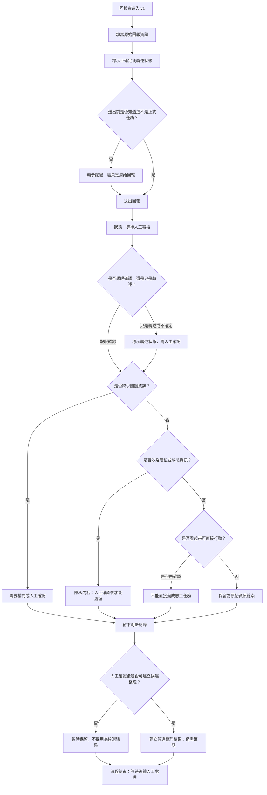

# 資訊流程設計

> 這份文件是 Codex 依 `release-packs/02-flow-design-kit/` 與目前討論產生的草稿。流程合理性必須由人檢查，不能把 AI 草稿當成最終決策。

## 我的 v1 目標

- 我優先服務的使用者：回報者
- 這個使用者最想完成的事：快速填寫自己看到或聽到的原始資訊，並清楚留下哪些內容不確定、哪些只是轉述。
- 我最想避免的錯誤：回報送出後被誤解成已確認資料，或被直接變成志工任務。

## 自然語言流程描述

```text
使用者一進 v1 先看到可以填寫回報資訊的畫面。
回報者填寫原始資訊時，可以標示「我不確定」「我是轉述」「缺少時間或地點」。
送出前，畫面提醒：這只是原始回報，不是已確認資料，也不會直接變成志工任務。
送出後，系統先把回報標示為「等待人工審核」。

人工審核時，第一步要確認回報者是否親眼確認，還是只是轉述。
如果回報缺少關鍵資訊，流程標示為「需要補問或人工確認」。
如果回報涉及個人位置、健康、長者或家屬資訊，流程標示為「隱私內容，需人工確認後才能處理」。
如果回報看起來像可以行動，但仍未確認，流程標示為「不能直接變成任務」。
只有人工確認後，才能建立候選整理結果；候選結果仍不能顯示為已確認。

每次送出、標示不確定、判斷需要人工確認、判斷不能直接變成任務，都要留下紀錄。
```

## Mermaid 流程圖

請用 VS Code 預覽，確認流程圖能正常顯示。



## 人工確認點

- 回報者是否親眼確認，還是只是轉述。
- 地點、時間、需求內容是否足夠讓後續協作者理解。
- 涉及個人位置、健康、長者或家屬資訊時，是否可以繼續處理。
- 回報是否能建立候選整理結果，或應該暫時保留。

## 不能自動處理的分支

- 不能讓 AI 自動把等待審核的回報變成已確認。
- 不能讓 AI 自動補完整地點、人物、電話或需求內容。
- 不能讓 AI 自動判斷是否派工、出發或採取真實救災行動。
- 不能讓 AI 自動決定隱私資訊能不能公開。

## 操作或判斷紀錄

- 回報者送出原始資訊時，要記錄送出內容與時間。
- 回報者標示「不確定」「只是轉述」時，要保留這些標示。
- 人工判斷需要補問、涉及隱私、不能直接變成任務時，要留下理由。
- 如果資訊被暫時保留或不採用為候選結果，也要記錄原因。

## 我檢查後修正了什麼

- 原本：流程只寫「填寫資訊後等待審核」。
- 修正後：補上送出前提醒、是否親眼確認或只是轉述、隱私分支、不能直接變成任務分支，以及判斷紀錄。
- 為什麼：`design-checklist` 要求流程不能把未確認資訊當成已確認，也必須至少有人工確認點、不能自動處理的分支和判斷紀錄。

## 我仍不確定的流程點

- 我還不確定 v1 是否真的要從「填寫回報」開始，因為目前資料來源仍是 Phase 0 既有原始資訊，不是新的真實回報。
- 我還不確定等待人工審核後，誰負責確認、確認到什麼程度才可以建立候選整理。
- 我還不確定哪些提醒文字最能讓回報者理解「送出不等於確認」。
